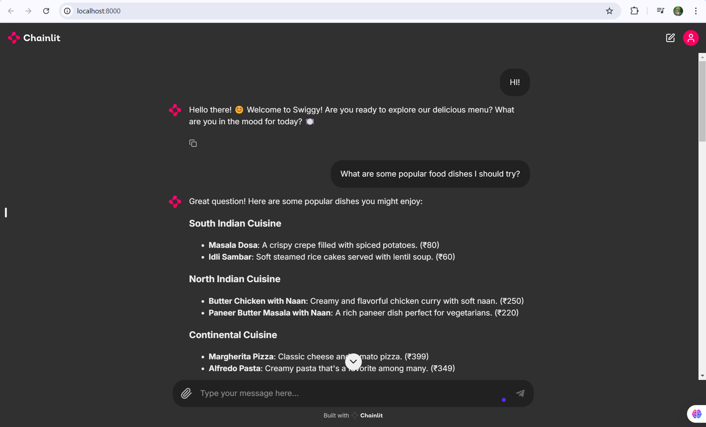
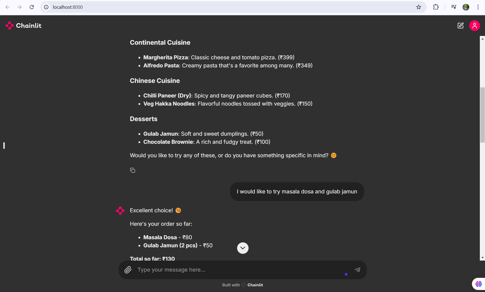
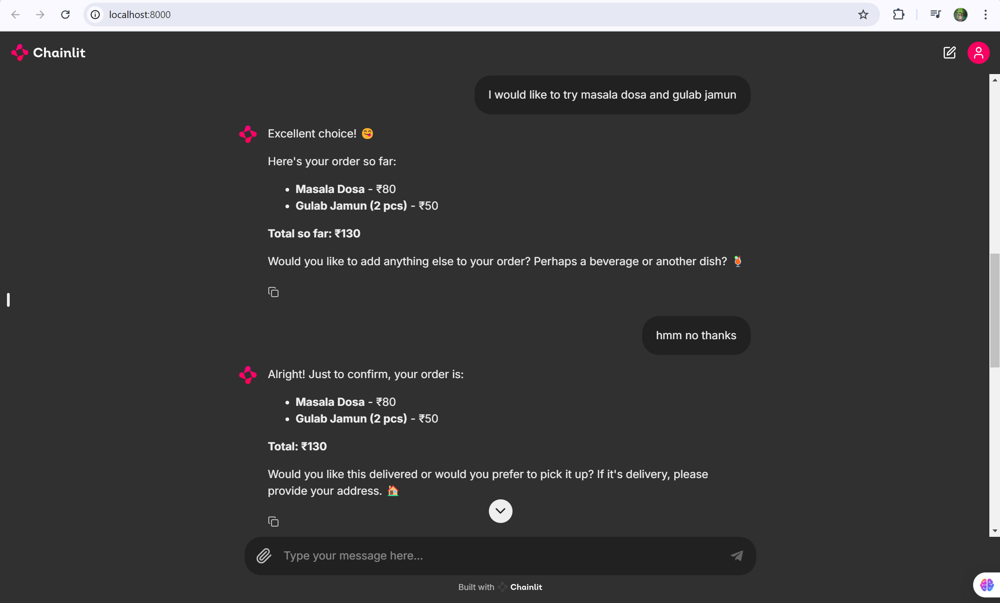
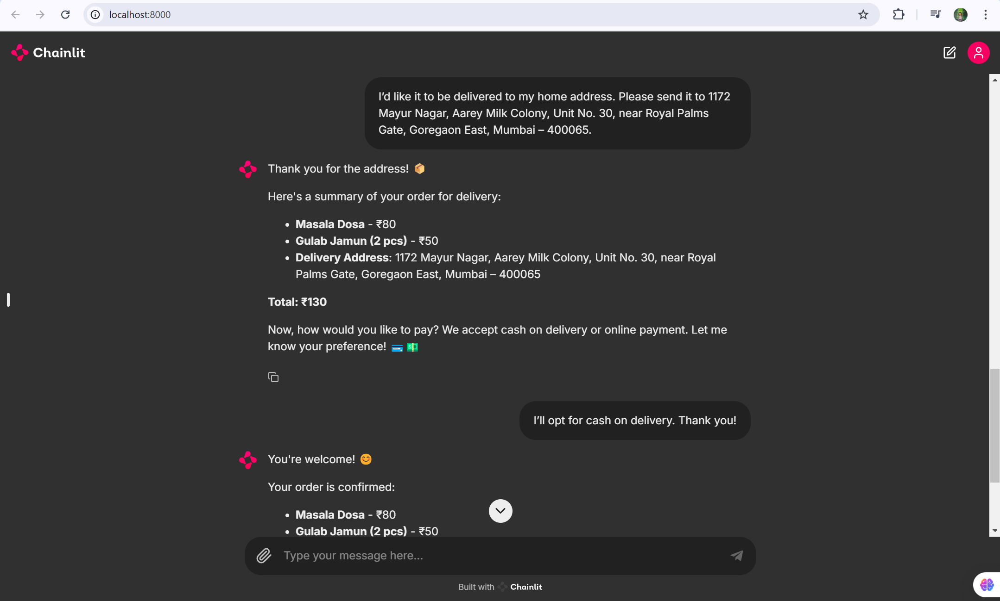
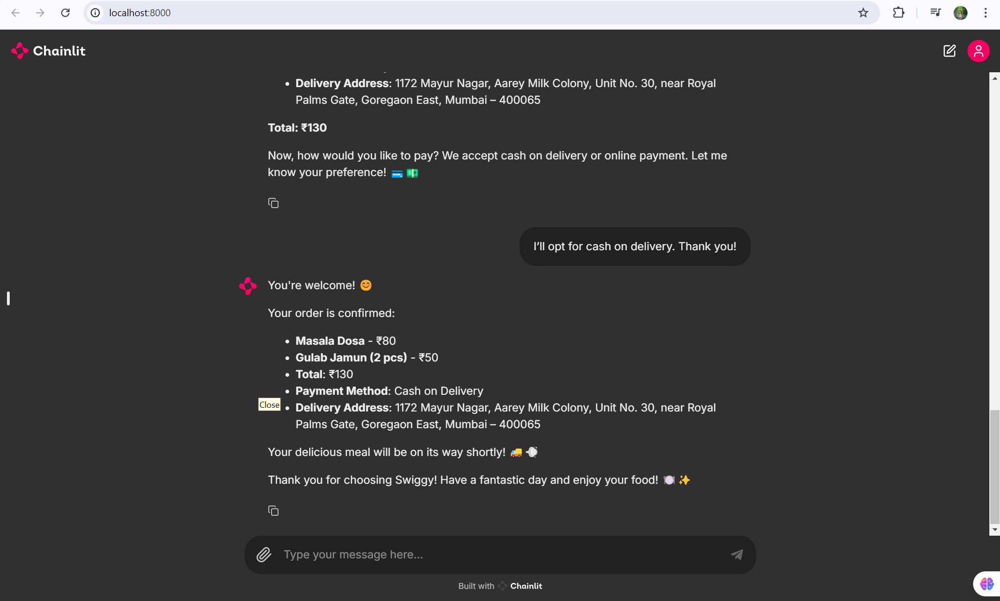

# 🍽️ Swiggy Chatbot

A chatbot designed to help users with food-related queries and recipes using Chainlit. This project primarily uses PowerShell, Python, and Batchfile.

## 📑 Table of Contents
- [Project Description](#project-description)
- [Installation](#installation)
- [Usage](#usage)
- [Features](#features)
- [Contributing](#contributing)
- [License](#license)
- [Contact](#contact)

## 📖 Project Description

Swiggy Chatbot is a chatbot that assists users with various food-related queries such as recipes, ingredients, and cooking techniques. This bot leverages Chainlit to provide an interactive and user-friendly experience. It is built as an LLM (Language Learning Model) application.

## 🛠️ Installation

### Prerequisites

- Python 3.11 
- PowerShell
- Pip (Python package manager)

### Steps

1. Clone the repository:
    ```sh
    git clone https://github.com/rakeshjoshi4/chainlit-foodie-bot.git
    cd chainlit-foodie-bot
    ```

2. Create and activate a virtual environment:
    ```sh
    python -m venv chainlitbot
    source chainlitbot/Scripts/activate  # On Windows
    source chainlitbot/bin/activate  # On Unix or MacOS
    ```

3. Install the required packages:
    ```sh
    pip install -r requirements.txt
    ```

4. Set up the `.env` file:
    - Create a file named `.env` in the root directory of the project.
    - Add your OpenAI API key to the `.env` file:
      ```plaintext
      OPENAI_API_KEY=your_openai_api_key_here
      ```

## 🚀 Usage

1. Ensure you have activated the virtual environment:
    ```sh
    source chainlitbot/Scripts/activate  # On Windows
    # source chainlitbot/bin/activate  # On Unix or MacOS
    ```

2. Run the application:
    ```sh
    python app.py
    ```

3. Interact with the bot through the command line or a connected interface.

## ✨ Features

- 🍲 Provides recipes and cooking techniques.
- ❓ Answers food-related queries.
- 🔧 Easy to use and extend.

## 📸 Screenshots

Here are some screenshots of the Swiggy Chatbot:







## 🤝 Contributing

We welcome contributions! Please follow these steps:

1. Fork the repository.
2. Create a new branch (`git checkout -b feature-branch`).
3. Make your changes.
4. Commit your changes (`git commit -m 'Add some feature'`).
5. Push to the branch (`git push origin feature-branch`).
6. Open a Pull Request.

## 📜 License

This project is licensed under the MIT License. See the [LICENSE](LICENSE) file for details.

## 📫 Contact

Rakesh Joshi - rakeshgjoshi4@gmail.com

Project Link: [https://github.com/rakeshjoshi4/chainlit-foodie-bot](https://github.com/rakeshjoshi4/chainlit-foodie-bot)
