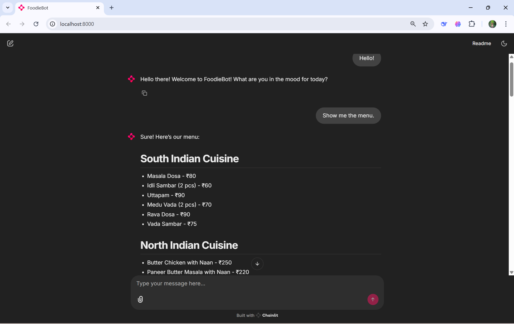
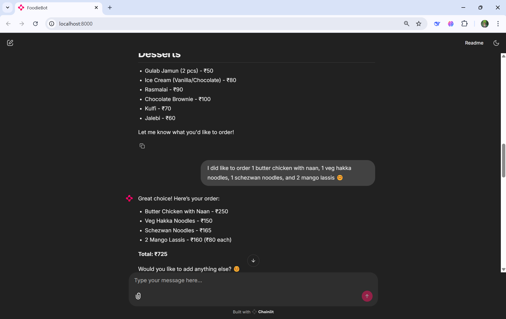
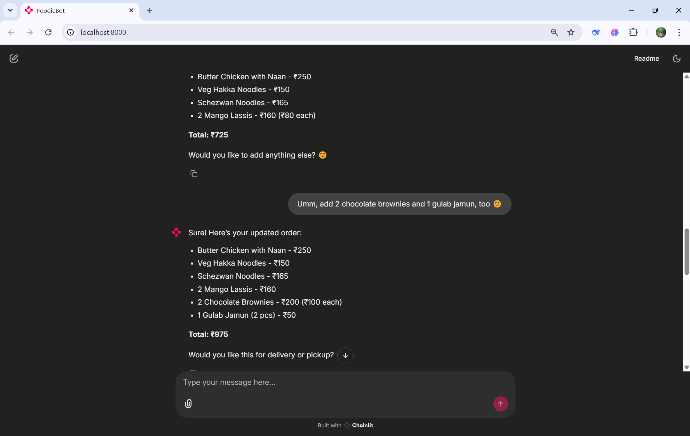
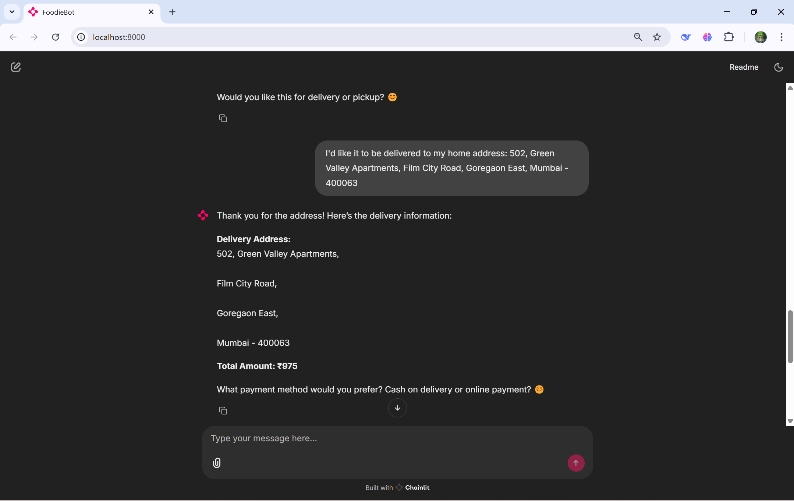
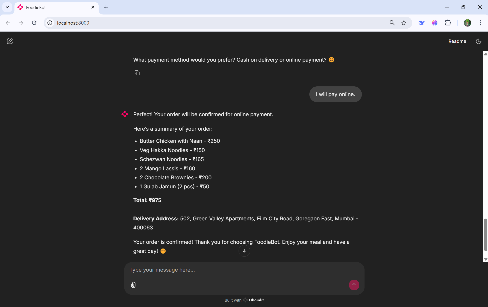
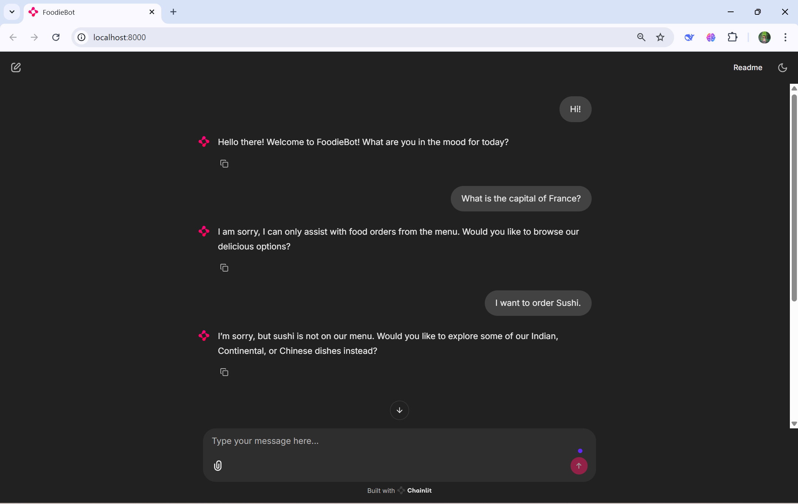

# 🍽️ FoodieBot

A prototype chatbot designed to help users explore menus and place food orders online, built with Chainlit and OpenAI.

## 📚 Table of Contents
- [📖 Project Description](#-project-description)
- [🛠️ Installation](#️-installation)
- [🚀 Usage](#-usage)
- [✨ Features](#-features)
- [⚙️ How It Works](#️-how-it-works)
- [📸 Screenshots](#-screenshots)
- [🤝 Contributing](#-contributing)
- [🏁 Conclusion](#-conclusion)
- [📜 License](#-license)
- [📞 Contact](#-contact)

## 📖 Project Description

FoodieBot is an AI-powered chatbot developed as a prototype during my internship. It assists users in exploring menus, placing orders, and discovering new dishes through a conversational interface. Powered by Chainlit and OpenAI's GPT model (`gpt-4o-mini`), FoodieBot offers a user-friendly experience for online food ordering while keeping costs low.

## 🛠️ Installation

### Prerequisites

- Python 3.11
- PowerShell
- Pip (Python package manager)

### Steps

1. Clone the repository:
    ```sh
    git clone https://github.com/rakeshjoshi4/chainlit-foodie-bot.git
    cd chainlit-foodie-bot
    ```

2. Create and activate a virtual environment:
    ```sh
    python -m venv foodiebot
    source foodiebot/Scripts/activate # On Windows
    source foodiebot/bin/activate # On Unix or MacOS
    ```

3. Install the required packages:
    ```sh
    pip install -r requirements.txt
    ```


4. Set up the `.env` file:

- Create a file named `.env` in the root directory of the project.
- Add your OpenAI API key to the `.env` file:

    ```
    OPENAI_API_KEY = enter_your_openai_api_key_here
    ```

## 🚀 Usage

1. Activate the virtual environment:
    ```sh
    source foodiebot/Scripts/activate # On Windows
    source foodiebot/bin/activate # On Unix or MacOS
    ```


2. Run the application:
    ```sh
    chainlit run app.py
    ```

3. Interact with the bot through the command line or a connected interface.

**Sample Queries:**

- "Show me the menu."
- "What are some popular dishes?"
- "I want to order Masala Dosa and Gulab Jamun."

## ✨ Features

- Explore detailed menus across multiple cuisines.
- Place orders with options for delivery or pickup.
- Receive personalized recommendations based on your preferences.
- Get order summaries with total costs and delivery details.
- Choose between cash on delivery or online payment (simulated).
- Enjoy interactive conversations with real-time assistance.

## ⚙️ How It Works

1. **User Interaction:** The user initiates a conversation to explore the menu or place an order.
2. **Menu Exploration:** FoodieBot presents categorized menu options with prices and descriptions.
3. **Order Placement:** Users select dishes, specify delivery details, and choose a payment method.
4. **Order Confirmation:** FoodieBot summarizes the order and confirms it with the user.

*Please note that this is a simulated ordering process. No actual orders are placed.*
*If an item is unavailable, FoodieBot will apologize and suggest alternatives from the menu.*

## 📸 Screenshots

Below is a step-by-step walkthrough of FoodieBot in action:

### Menu Exploration

*The bot greets the user and displays the menu categories and items.*

### Order Placement (Step 1)

*The user starts placing an order, and the bot summarizes the initial items.*

### Order Placement (Step 2)

*The user modifies the order, and the bot updates the summary and total.*

### Delivery Details

*The bot collects the delivery address and confirms the total amount.*

### Payment & Confirmation

*The user selects a payment method, and the bot confirms the order with a summary.*

### Error Handling

*The bot gracefully handles non-food queries and unavailable menu items.*

## 🤝 Contributing

We welcome contributions! Please follow these steps:

1. Fork the repository.
2. Create a new branch (`git checkout -b feature-branch`).
3. Make your changes.
4. Commit your changes (`git commit -m 'Add some feature'`).
5. Push to the branch (`git push origin feature-branch`).
6. Open a Pull Request.

## 🏁 Conclusion

FoodieBot represents a successful demonstration of how AI can enhance online food ordering through a conversational chatbot. This project showcases effective integration of Chainlit for creating interactive user interfaces and OpenAI's GPT model for intelligent natural language processing. Key achievements include a comprehensive menu exploration, order placement, and error handling. While this is a prototype, it lays a solid foundation for future enhancements such as integration with real-world food delivery services, expanded menu options, and voice-based interaction. Overall, FoodieBot demonstrates the potential of AI-powered chatbots to transform and enhance user experiences.

## 📜 License

This project is licensed under the MIT License. See the [LICENSE](LICENSE) file for details.

## 📞 Contact

For questions, feedback, or issues, please [open an issue](https://github.com/rakeshjoshi4/chainlit-foodie-bot/issues) or contact me directly.
